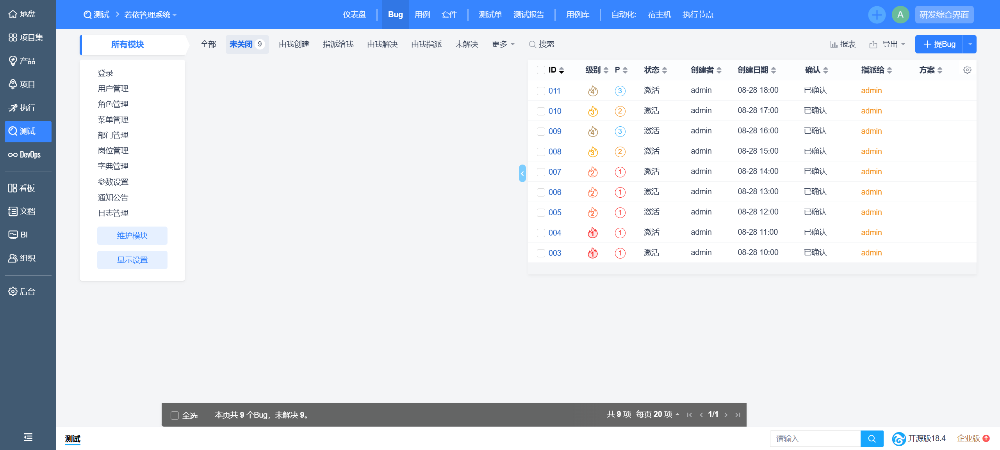
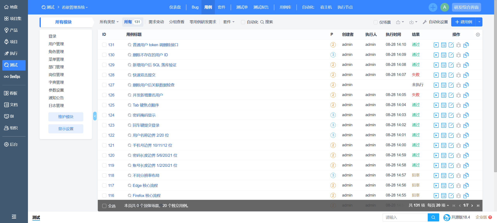
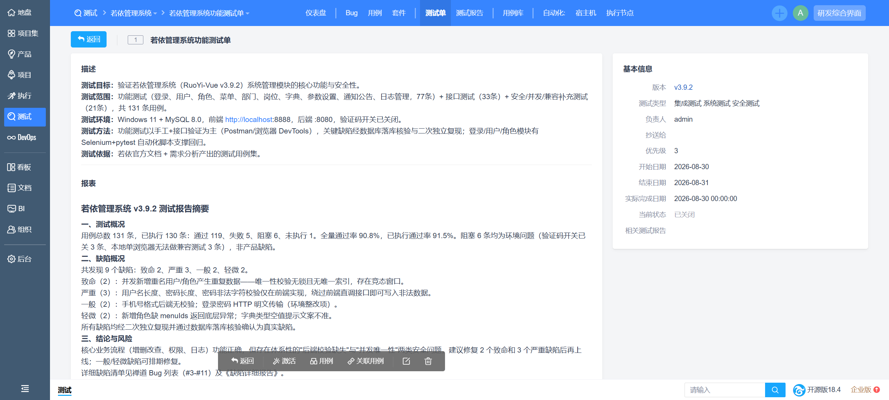
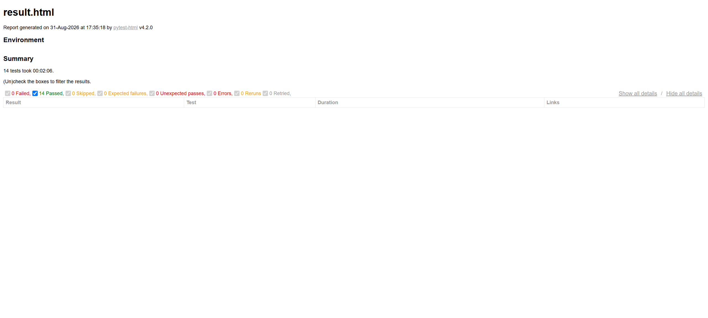

# 若依管理系统测试项目（RuoYi-Vue3 v3.9.2）

针对开源后台管理系统 [RuoYi-Vue3](https://gitee.com/y_project/RuoYi-Vue3) v3.9.2（Vue3 + Vite + Element Plus 前端）的完整测试实践：测试用例设计 → 功能/接口测试执行 → 缺陷发现与管理 → UI 自动化，全流程产出物归档于 `docs/`，自动化脚本见 `ruoyi_auto/`。

## 项目成果速览

| 项 | 数据 |
|---|---|
| 测试用例 | **131 条**（功能 77 + 接口 33 + 安全/并发/兼容补充 21） |
| 执行结果 | 通过 119 / 失败 5 / 阻塞 6 / 未执行 1（已执行通过率 91.5%） |
| 发现缺陷 | **9 个**（致命 2、严重 3、一般 2、轻微 2），全部二次复现 + 数据库落库核验 |
| UI 自动化 | Selenium + pytest，14 条回归用例全部通过（登录/用户增删改查/角色） |
| 缺陷管理 | 禅道 18.4（产品 → 用例 → 测试单 → Bug → 测试报告全闭环） |

## 测试亮点

- **并发竞态缺陷**：并发新增重名用户/角色均成功写入，定位到唯一性校验无锁 + 无唯一索引的竞态窗口（致命 ×2）
- **绕过前端校验**：直接调接口写入 1 位用户名、4 位弱密码、非法字符密码、乱码手机号并落库实证，暴露后端校验缺失的体系性问题（严重 ×3）
- 每个关键缺陷都有数据库记录作为证据，非脚本误报（见 `docs/缺陷详细报告.md`）

## 效果截图

| 禅道 Bug 列表（9 个缺陷） | 用例执行结果（131 条） |
|---|---|
|  |  |

| 测试单详情 | 自动化 14/14 全通过 |
|---|---|
|  |  |

## 目录结构

```
├── .env.example                 # 环境变量示例（被测地址/账号/数据库，真实密码不入库）
├── sql/                         # 缺陷落库核验 SQL（对应缺陷报告的数据库证据）
├── docs/                        # 测试产出物 + 截图证据
│   ├── 功能测试用例.xlsx          # 77 条
│   ├── 接口测试用例.xlsx          # 33 条
│   ├── 补充测试用例.xlsx          # 21 条（安全/并发/兼容）
│   ├── 测试执行报告.xlsx          # 131 条逐条执行明细与证据
│   ├── 缺陷复现用例（9条）.xlsx     # 9 个 Bug 对应的可复现用例（含实际结果）
│   ├── 缺陷详细报告.md            # 9 个完整缺陷单（含复现步骤与根因）
│   ├── 若依管理系统测试报告.md     # 测试总结报告（含结果口径说明）
│   └── screenshots/             # 效果截图（禅道/自动化/缺陷复现）
├── postman/                     # 接口测试（33 条用例的 Collection，导入即用）
└── ruoyi_auto/                  # UI 自动化（Selenium + pytest，Page Object 模式）
    ├── conftest.py              # fixture：driver 管理、登录态清理
    ├── pytest.ini
    ├── requirements.txt
    ├── pages/                   # Page Object 封装
    │   ├── base_page.py         # 通用操作：等待、消息提示、图标按钮悬停识别
    │   ├── login_page.py
    │   └── user_page.py
    └── tests/                   # 测试用例（14 条）
        ├── test_login.py        # 登录：正常/错误密码/边界值参数化（含对比组断言）
        ├── test_user_crud.py    # 用户：新增/重复拦截/手机号校验/修改验证/删除后验证不存在
        └── test_role_create.py  # 角色：新增完整流程 + 数据清理
```

## 运行方式（自动化部分）

### 前置条件

1. 部署 RuoYi-Vue3 v3.9.2，前端访问地址 `http://localhost:8888`（其他地址设环境变量 `RUOYI_BASE_URL`）
2. 关闭登录验证码：系统参数 `sys.account.captchaEnabled` 设为 `false`
3. Chrome 浏览器 + 对应版本 ChromeDriver

### 安装与执行

```bash
cd ruoyi_auto
pip install -r requirements.txt
pytest                        # 一条命令跑全部用例并自动生成 HTML 报告（见 pytest.ini）
```

可选：按 `.env.example` 设置环境变量覆盖被测地址/账号；设置 `RUOYI_DB_PASSWORD` 后，跑用例前会自动清理残留测试用户（不设置则跳过，不影响执行）。

失败用例自动截图保存至 `ruoyi_auto/reports/screenshots/`。

## 运行方式（接口测试部分）

1. 导入 `postman/若依接口测试.postman_collection.json`（Postman 左上角 Import）
2. 前置：若依已启动、验证码开关已关闭（`sys.account.captchaEnabled=false`）
3. 集合右键 → **Run collection**，默认顺序即可（退出登录用例已排在最后，登录脚本会自动存 token）
4. 断言统一判响应体 `code`（若依业务失败也是 HTTP 200：500 业务错误 / 601 警告 / 401 认证失败）

## 技术栈

Python 3 / Selenium 4 / pytest（fixture + 参数化）/ Page Object 模式 / Postman（接口）/ pymysql（落库验证）/ 禅道 18.4（缺陷管理）

## 踩坑记录（自动化部分）

- 若依登录态存于 Cookie `Admin-Token`，用例间隔离必须连 Cookie 一起清，只清 localStorage 无效
- RuoYi-Vue3（Element Plus）行内操作按钮为纯 SVG 图标无文字，需悬停出 tooltip 再识别点击
- Vue 渲染产生的注释节点会拆分文本节点，XPath 匹配标签文本须用 `contains(.,...)` 而非 `contains(text(),...)`

## 后续优化方向（Roadmap）

1. **接口测试工程化**：引入 Newman 命令行 + CI 定时回归，替代 Postman GUI 手工执行；业务回归集与缺陷复现集分离，断言更严格
2. **自动化覆盖扩展**：角色权限闭环（授权 → 绑定用户 → 登录验菜单）、角色重复/必填校验、数据权限负向用例脚本化；等待策略向显式等待全面迁移（等 URL/弹窗/消息/表格刷新）
3. **测试数据治理**：统一 fixture 管理测试数据生命周期（创建 → 使用 → 清理 → 验证清理），覆盖接口测试产生的角色/菜单/部门
4. **专项测试补齐**：安全专项（XSS/SQL 注入/越权）、并发窗口量化压测（JMeter）、多浏览器兼容（Selenium Grid）
5. **环境可复现**：docker-compose 一键拉起被测环境并锁定版本，降低复现门槛
