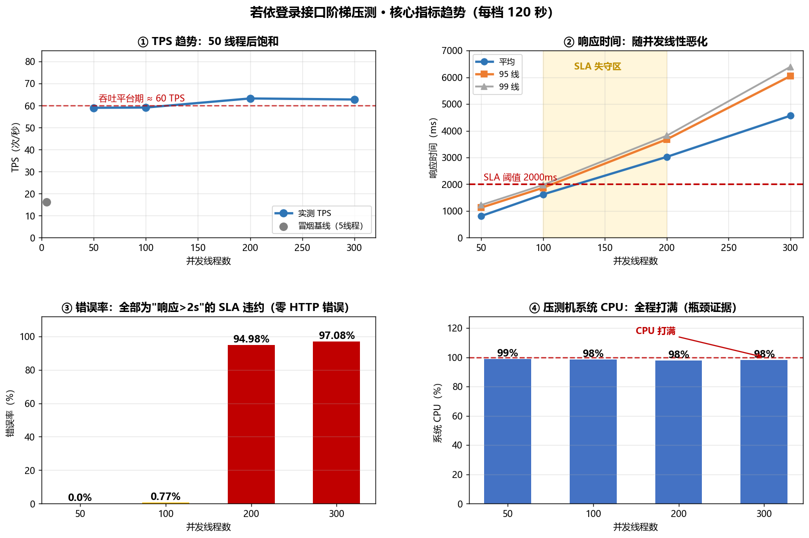
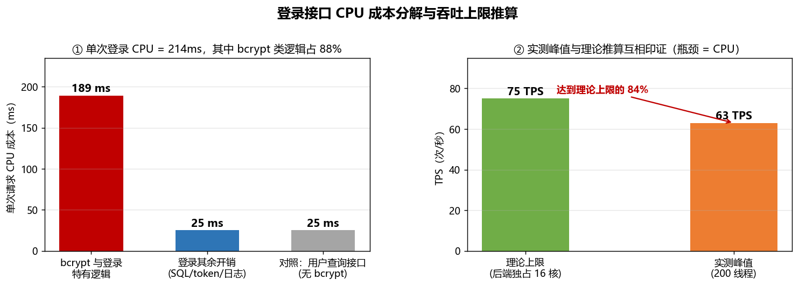

# 若依登录接口性能测试（JMeter）

> 对 RuoYi-Vue3 v3.9.2 登录接口 `POST /login` 的 **4 档阶梯压测**（50/100/200/300 并发，每档 120 秒）
> 目的：定位系统吞吐上限与 SLA 失守点，量化瓶颈层级
> 工具：Apache JMeter 5.6.3（CLI 模式）｜ 2026-09-23

---

## 一、核心成果

| 指标 | 结果 |
|---|---|
| 压测规模 | 4 档阶梯 × 120 秒，共 **29,595 次请求**（50/100/200/300 线程） |
| **吞吐上限** | **约 60 TPS**（50 线程即饱和，加并发不再增长） |
| **SLA 失守点** | **100~200 线程之间**（95 线由 1,867ms 跃至 3,679ms，跨越 2s 阈值） |
| **推荐并发** | **≤ 100 线程**（95 线 1,867ms、错误率 0.77%，仍满足 SLA） |
| HTTP 错误 | **0 个**——零 5xx、零连接拒绝，系统未崩溃 |
| **瓶颈定位** | **应用层 CPU**：单次登录耗 214ms CPU（3 次测量 207~219ms），其中 **bcrypt 密码哈希等登录特有逻辑占 88%** |
| 数据可信度 | 实测数据符合 Little's Law（TPS ≈ 并发 ÷ 响应时间），四项全部吻合 |

### 四档指标总表

| 线程数 | 总请求 | TPS | 平均 RT | 中位数 | 90 线 | **95 线** | 99 线 | 最大 | **错误率** |
|:--:|:--:|:--:|:--:|:--:|:--:|:--:|:--:|:--:|:--:|
| 50 | 7,102 | **59.00** | 812 ms | 877 ms | 1,073 ms | **1,126 ms** | 1,225 ms | 1,484 ms | **0.00%** |
| 100 | 7,133 | **59.11** | 1,620 ms | 1,682 ms | 1,817 ms | **1,867 ms** | 1,973 ms | 2,448 ms | **0.77%** |
| 200 | 7,684 | **63.24** | 3,023 ms | 3,073 ms | 3,603 ms | **3,679 ms** | 3,816 ms | 4,198 ms | **94.98%** |
| 300 | 7,676 | **62.76** | 4,563 ms | 4,644 ms | 5,814 ms | **6,046 ms** | 6,393 ms | 8,105 ms | **97.08%** |

> 错误率的构成：四档 HTTP 状态码 **100% 为 200**，所有"失败"均为**响应时间超过 2000ms 的 SLA 断言失败**，非接口故障。

---

## 二、核心趋势图



**读图结论**：
- **① TPS**：50 线程即达 59 TPS 平台期，200/300 线程仅提升 7% 后回落 → 系统吞吐饱和
- **② 响应时间**：随并发近似线性增长（812→1,620→3,023→4,563 ms），200 线程起跨越 2s SLA 红线
- **③ 错误率**：0% → 0.77% → 94.98% → 97.08%，在 100~200 档之间突变
- **④ 系统 CPU**：全程 98%~100% 打满 → 瓶颈在 CPU

### 瓶颈量化分析



通过“单请求 CPU 成本”直接测量（预热 10 次后串行发压 50 次，读进程 CPU 时间增量；重复 3 次取区间；脚本见 `scripts/cpu_cost.py`）：

| 请求 | 单次 CPU 成本 | 说明 |
|---|:--:|---|
| `POST /login` | **214 ms**（207~219） | 含 bcrypt 密码哈希、token 生成、登录日志写入 |
| `GET /system/user/list` | 25 ms（22~31） | 无 bcrypt，仅 token 校验 + SQL 查询 |
| **差值（bcrypt 与登录特有逻辑）** | **189 ms** | **占登录总 CPU 的 88%（86%~89%）** |

**吞吐上限推算**：`16 逻辑核 ÷ 0.214 秒 ≈ 75 TPS`（后端独占全部 CPU 的理论极限）；
实测峰值 **63.24 TPS**（200 线程）= 理论独占上限的 **84%**——即后端实际可用约 13.5 核，其余被 JMeter、MySQL、Redis 与系统进程占用。

---

## 三、关键发现

1. **吞吐量在 50 线程饱和**：TPS 平台期 ≈ 60，继续加并发只增加排队延迟，不产生有效吞吐
2. **系统优雅降级而非故障**：300 并发下零 5xx、零连接拒绝，仅响应时间劣化——说明服务本身健壮，只是容量被 CPU 限制
3. **瓶颈根因是 bcrypt（安全设计使然，非缺陷）**：bcrypt 刻意设计为慢速哈希以抵抗暴力破解，代价是登录接口吞吐受 CPU 限制
4. **可优化项：后端日志级别为 `debug`**，每次登录打印多条 MyBatis SQL，额外增加 CPU 与磁盘 IO 开销（生产环境应为 info/warn）
5. **数据可信**：四档实测均符合 Little's Law：

   ```
   50 线程 :  50 ÷ 0.812s = 61.6  ←→ 实测 59.00  ✓
   100 线程: 100 ÷ 1.620s = 61.7  ←→ 实测 59.11  ✓
   200 线程: 200 ÷ 3.023s = 66.2  ←→ 实测 63.24  ✓
   300 线程: 300 ÷ 4.563s = 65.7  ←→ 实测 62.76  ✓
   ```

---

## 四、目录结构

```
performance/
├── README.md                    # 本文件：结论速览
├── 压测报告.md                   # 完整报告（环境/场景/结果/拐点/瓶颈/建议/局限）
├── .gitignore                   # 声明本地产物（HTML 报告/操作笔记/应急脚本）不入库
├── charts/                      # 图表与截图
│   ├── 01_核心指标趋势.png      #   由真实数据经 生成图表.py 产出
│   ├── 02_瓶颈分析.png          #   由真实数据经 生成图表.py 产出
│   ├── 03_冒烟验证_5线程.png    #   JMeter HTML 报告 Dashboard 截图（04~07 同）
│   ├── 04_阶梯_50线程.png
│   ├── 05_阶梯_100线程.png
│   ├── 06_阶梯_200线程.png
│   └── 07_阶梯_300线程.png
├── scripts/                     # 全部脚本
│   ├── ruoyi_login.jmx          #   压测脚本（参数化线程组 + 双断言）
│   ├── ruoyi_chain_param.jmx    #   接口链脚本（CSV 参数化 + Token 关联）
│   ├── users.csv                #   参数化数据文件（5 个测试账号，供上表脚本读取）
│   ├── analyze_jtl.py           #   指标分析（输出 90/95/99 线、TPS、错误分类）
│   ├── monitor.py               #   资源监控（CPU/内存/MySQL 连接，2 秒采样）
│   ├── cpu_cost.py              #   单请求 CPU 成本测量（报告 6.2 节证据）
│   ├── 生成图表.py               #   从 JTL + 监控数据生成趋势图
│   └── 运行压测.bat              #   一键运行（菜单式，自动清理旧数据）
└── results/                     # 原始数据——报告所有数字的可复算依据
    ├── result_50~300.jtl        #   四档原始结果（每档 120 秒）
    ├── smoke.jtl                #   冒烟验证（5 线程）
    ├── chain.jtl                #   接口链验证结果（563 请求 / 0 失败，见第六章）
    ├── monitor_*.csv            #   资源监控数据（1,746 个采样点）
    └── 压测指标汇总.csv          #   四档指标机器可读汇总
```

> **未入库项**（已在 `.gitignore` 声明）：`reports/` JMeter HTML 报告（17MB 生成物，可用「五、如何复现」一行命令重新生成）、
> `P3实操手册.md`（个人操作笔记）、`scripts/restart_backend.bat`（含本机部署路径，他人无法复用）；
> 各档 Dashboard 截图已归档至 `charts/03~07`。

---

## 五、如何复现

### 前置条件

1. RuoYi-Vue3 v3.9.2 后端运行于 `http://localhost:8080`
2. 关闭登录验证码：系统参数 `sys.account.captchaEnabled = false`
3. Apache JMeter 5.x（需 Java 8+）

### 执行

```bash
# ① 冒烟验证脚本（5 线程 / 15 秒）
jmeter -n -t scripts/ruoyi_login.jmx -Jthreads=5 -Jrampup=3 -Jduration=15 \
       -l results/smoke.jtl -e -o reports/smoke

# ② 预热（10 线程 / 30 秒，消除 JVM 冷启动影响）
jmeter -n -t scripts/ruoyi_login.jmx -Jthreads=10 -Jrampup=5 -Jduration=30 \
       -l results/warmup.jtl -e -o reports/warmup

# ③ 四档阶梯压测
jmeter -n -t scripts/ruoyi_login.jmx -Jthreads=50  -Jrampup=10 -Jduration=120 -l results/result_50.jtl  -e -o reports/report_50
jmeter -n -t scripts/ruoyi_login.jmx -Jthreads=100 -Jrampup=10 -Jduration=120 -l results/result_100.jtl -e -o reports/report_100
jmeter -n -t scripts/ruoyi_login.jmx -Jthreads=200 -Jrampup=10 -Jduration=120 -l results/result_200.jtl -e -o reports/report_200
jmeter -n -t scripts/ruoyi_login.jmx -Jthreads=300 -Jrampup=10 -Jduration=120 -l results/result_300.jtl -e -o reports/report_300

# ④ 指标分析 + 生成图表
python scripts/analyze_jtl.py
python scripts/生成图表.py

# ⑤ 单请求 CPU 成本测量（瓶颈分析证据，串行小样本，约 1 分钟）
python scripts/cpu_cost.py
```

> Windows 用户可直接双击 `scripts/运行压测.bat`，按菜单选择档位（自动清理旧数据、避免重复运行报错）。

---

## 六、脚本设计要点（技术细节）

| 设计 | 说明 |
|---|---|
| **参数化线程组** | 线程数/Ramp-Up/持续时间用 `${__P(threads,50)}` 从命令行注入，**一个脚本跑完四档**，避免手工改脚本引入误差 |
| **双断言** | ① 断言响应体含 `"code":200`——若依业务失败时 HTTP 仍返 200（HTTP 200 + body `code:500`），只断言状态码会漏判；② 断言响应时间 < 2000ms，用于量化 SLA 违约 |
| **CLI 非 GUI 模式** | GUI 模式的监听器渲染会消耗压测机资源导致数据失真；脚本内不保留任何监听器，结果由 `-l` / `-e -o` 事后生成 |
| **预热前置** | 冒烟测试发现前 5 个请求响应 967~3263ms（JVM 冷启动 + 连接池初始化），第 6 个起骤降至 280ms；遂将预热列为正式压测前的规范步骤（本次四档实测早于该步骤落地，但第 1 档数据未出现冷启动污染：最小 203ms、错误率 0%） |
| **资源监控** | 定制 `monitor.py` 每 2 秒采样系统 CPU/可用内存/MySQL 连接数，与 JTL 时间轴对齐后用于排除法定位瓶颈 |
| **CSV 参数化** | `ruoyi_chain_param.jmx`：CSV Data Set Config 循环读取 `users.csv`（5 个账号）→ 登录请求用 `${username}`/`${password}` 引用，模拟多用户并发（避免单账号反复登录命中缓存或触发锁定策略） |
| **Token 关联** | 同一脚本：登录请求下挂 JSON 提取器（变量名 `token`，表达式 `$.token`）→ 下游 `/getInfo` 在 Header 中用 `Bearer ${token}` 引用 |
| **参数化/关联的验证方式** | 不看脚本看数据：① 查数据库 `sys_logininfor`——5 个账号各登录 58 次左右，证明参数化真的轮询生效；② 下游 `/getInfo` 零失败（断言含 `roles`）——token 无效会返 401 且无 roles，零失败即证明关联生效 |

### 排错记录

- **进程 CPU 监控失效（已修复）**：初版用 `psutil.Process(pid).cpu_percent(interval=None)`，因每次新建 Process 对象缺少基线导致恒为 0；
  改用 `cpu_times()` 差值计算后恢复正常（实测后端占用 98%~113%）。
  ⚠️ **注意**：该修复发生在本次压测**之后**，因此 `results/monitor_*.csv` 中的进程级 CPU 列仍为 0（系统级 CPU/内存/MySQL 连接列有效）。
  本次瓶颈归因未依赖该列，而采用“系统级 CPU 打满 + 单请求 CPU 成本测量”两重证据（详见《压测报告.md》第六章）。
- **JTL 指标口径**：JMeter HTML 报告的百分位与定制分析脚本线性插值结果可能存在极小差异，报告中统一以 `scripts/analyze_jtl.py` 为准
- **CPU 成本测量口径修正**：初版测量预热仅 5 次，对照组（用户列表接口）仍处于 JIT 编译期（出现「CPU 68ms > 墙钟 17ms」的异常数据），导致 bcrypt 占比被低估为 63%；
  改为预热 10 次 + 串行 50 次 + 重复 3 次（脚本 `scripts/cpu_cost.py`）后修正为 **88%（86%~89%）**——定性结论（瓶颈在 bcrypt）不变，但量化占比更准

---

## 七、局限说明

1. **单机部署**：压测工具与被测系统、MySQL、Redis 同机运行、互相争抢 CPU，**测量值偏悲观，不代表生产环境容量**
2. **非生产数据量**：数据库为初始化数据，未覆盖大数据量下的查询性能
3. **单账号场景**：使用 `admin` 单账号，未做 CSV 多账号参数化，未覆盖多用户并发下的锁竞争
4. **无网络延迟**：localhost 通信无真实网络链路耗时，弱网场景未覆盖
5. **日志级别非生产配置**：测试环境为 `debug`，放大了 CPU 开销
